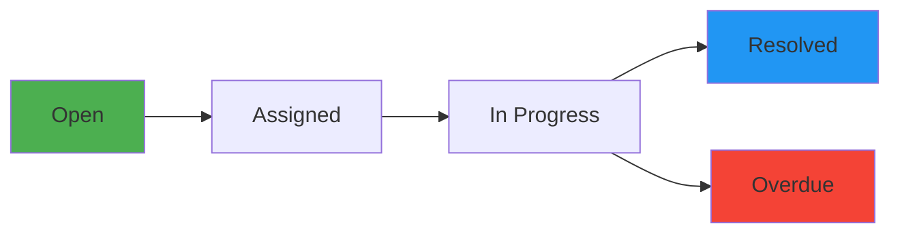

<div align="center">


<br/>

[](https://github.com/shivamtomar)
[](https://linkedin.com/in/shivamtomar)
[](#)

</div>

<br/>


##  TECH PROFILE

```typescript
interface Developer {
  name: string;
  role: string;
  experience: string;
  location: string;
  education: string;
  availability: string;
}

const shivamTomar: Developer = {
  name: "Shivam Tomar",
  role: "Full Stack Web Application Developer",
  experience: "4.5+ years in production environments",
  location: "India",
  education: "M.Tech (In Progress)",
  availability: "Actively seeking full-time opportunities",
  
  core_expertise: {
    backend: ["PHP", "Python", "FastAPI", "REST APIs", "MySQL"],
    frontend: ["React", "JavaScript", "Data Visualization"],
    architecture: ["MVC Pattern", "Service Layer", "API Design"],
    infrastructure: ["Docker", "Redis", "Linux", "Git"],
  },
  
  production_systems: [
    "Ticket & Query Workflow Management Platform",
    "Attendance Analytics & Reporting Dashboard", 
    "API Processing & Query Analyzer Microservice"
  ],
  
  principles: [
    "Production-grade > Tutorial projects",
    "Clean architecture & maintainable code",
    "Database-first design thinking",
    "Real-world problem solving"
  ]
};
```

<br/>

<div align="center">

##  TECHNOLOGY STACK

### 🔹 Core Technologies

<table align="center">
  <tr>
    <td align="center" width="140" height="112.5">
      
      <br/><strong>JavaScript</strong>
    </td>
    <td align="center" width="140" height="112.5">
      
      <br/><strong>PHP</strong>
    </td>
    <td align="center" width="140" height="112.5">
      
      <br/><strong>Python</strong>
    </td>
    <td align="center" width="140" height="112.5">
      
      <br/><strong>React</strong>
    </td>
    <td align="center" width="140" height="112.5">
      
      <br/><strong>FastAPI</strong>
    </td>
  </tr>
  <tr>
    <td align="center" width="140" height="112.5">
      
      <br/><strong>MySQL</strong>
    </td>
    <td align="center" width="140" height="112.5">
      
      <br/><strong>Redis</strong>
    </td>
    <td align="center" width="140" height="112.5">
      
      <br/><strong>Docker</strong>
    </td>
    <td align="center" width="140" height="112.5">
      
      <br/><strong>Git</strong>
    </td>
    <td align="center" width="140" height="112.5">
      
      <br/><strong>Linux</strong>
    </td>
  </tr>
</table>

### 🔹 Additional Tools & Skills


</div>

<br/>


##  PRODUCTION SYSTEMS PORTFOLIO

<div align="center">

###  TICKET & QUERY WORKFLOW MANAGEMENT SYSTEM

<table>
<tr>
<td width="50%">

**SYSTEM OVERVIEW**

Enterprise workflow automation platform managing complete ticket lifecycles with role-based governance and real-time analytics.

**ARCHITECTURE**
- Multi-tier MVC architecture
- RESTful API layer
- Relational database design
- Session-based authentication

</td>
<td width="50%">

**TECHNICAL IMPLEMENTATION**



**STACK:** `PHP` `MySQL` `JavaScript` `REST`

</td>
</tr>
</table>

**KEY FEATURES**
- 🔄 **Workflow Engine:** Multi-stage state management with business rule validation
- 👥 **RBAC System:** Granular permissions for Admin/Mentor/User roles  
- 📊 **Analytics Dashboard:** Real-time KPIs and performance metrics
- 🗄️ **Database Optimization:** Indexed queries, normalized schema, complex joins
- ⚡ **Performance:** Sub-100ms query response times on 100K+ records

</div>

<br/>

<div align="center">

###  ATTENDANCE ANALYTICS & REPORTING PLATFORM

<table>
<tr>
<td width="50%">

**SYSTEM OVERVIEW**

High-performance reporting engine delivering multi-dimensional analytics with dynamic aggregations and interactive visualizations.

**DATA PIPELINE**
- SQL-based ETL processes
- Aggregation layer (Redis cache)
- REST API exposure
- React visualization layer

</td>
<td width="50%">

**TECHNICAL SPECS**

- **Query Optimization:** 10x faster aggregations
- **Caching Strategy:** Redis-backed data layer
- **API Design:** Paginated responses, filter DSL
- **Frontend:** Component-based React architecture

**STACK:** `React` `PHP` `MySQL` `Chart.js` `Redis`

</td>
</tr>
</table>

**KEY FEATURES**
- 📈 **Dynamic Reporting:** Mentor/Week/Year dimensions with drill-down
- ⚡ **Performance Tuning:** Optimized aggregate queries + materialized views
- 🔍 **Advanced Filtering:** Multi-parameter search with date ranges
- 📡 **API-First Design:** Decoupled backend/frontend architecture
- 📊 **Data Visualization:** Interactive charts with export capabilities

</div>

<br/>

<div align="center">

###  API PROCESSING & QUERY ANALYZER MICROSERVICE

<table>
<tr>
<td width="50%">

**SYSTEM OVERVIEW**

High-throughput FastAPI microservice for structured data processing and analytical query execution.

**MICROSERVICE DESIGN**
- Asynchronous request handling
- JSON schema validation
- Pandas-based processing engine
- Structured response formatting

</td>
<td width="50%">

**TECHNICAL FEATURES**

- **Async I/O:** Non-blocking request processing
- **Data Validation:** Pydantic models
- **Batch Processing:** Concurrent job execution
- **API Documentation:** Auto-generated OpenAPI specs

**STACK:** `Python` `FastAPI` `Pandas` `Redis`

</td>
</tr>
</table>

**KEY FEATURES**
- 🚀 **High Performance:** 1000+ req/sec throughput capability
- 📦 **Data Processing:** CSV/Excel/JSON ingestion & transformation
- 🔄 **Batch Operations:** Async job queue with status tracking
- 🧩 **Modular Design:** Plugin-based analyzer architecture
- 📋 **OpenAPI Docs:** Interactive Swagger UI for API testing

</div>

<br/>


##  ENGINEERING COMPETENCIES

<div align="center">

<table>
<tr>
<td width="33%" valign="top">

### ⚙️ BACKEND ENGINEERING
```yaml
API Development:
  - RESTful architecture
  - Endpoint design & versioning
  - Authentication (JWT/Session)
  - Rate limiting & throttling

Database Engineering:
  - Schema design & normalization
  - Query optimization & indexing
  - Transaction management
  - Migration strategies

Architecture:
  - MVC pattern implementation
  - Service layer abstraction
  - Dependency injection
  - Error handling & logging
```

</td>
<td width="33%" valign="top">

### 🎨 FRONTEND ENGINEERING
```yaml
React Development:
  - Functional components & hooks
  - State management (Context/Redux)
  - Custom hooks development
  - Component composition

UI Implementation:
  - Responsive design
  - Data visualization (Chart.js)
  - Form handling & validation
  - API integration (Fetch/Axios)

Performance:
  - Code splitting
  - Lazy loading
  - Memoization techniques
  - Bundle optimization
```

</td>
<td width="33%" valign="top">

### 🛠️ DEVOPS & INFRASTRUCTURE
```yaml
Containerization:
  - Docker multi-stage builds
  - docker-compose orchestration
  - Volume management
  - Network configuration

Version Control:
  - Git workflow (feature branches)
  - Code review processes
  - Merge conflict resolution
  - Semantic versioning

System Administration:
  - Linux server management
  - Nginx configuration
  - Process monitoring
  - Log aggregation
```

</td>
</tr>
</table>

</div>

<br/>


##  ACHIEVEMENTS & RECOGNITION

<div align="center">

<table>
<tr>
<td align="center" width="50%">


### 🏆 SHOOLINI UNIVERSITY AWARD
**Award of Recognition**

Recognized for outstanding contributions in software development and technical innovation during academic tenure.

**Category:** Technical Excellence  
**Year:** 2024

</td>
<td align="center" width="50%">


### 💻 HACKATHON CHAMPIONSHIP
**1st Place Winner**

Led development team to victory with innovative full-stack solution under time constraints.

**Role:** Team Lead & Full Stack Developer  
**Achievement:** Top Solution among 50+ teams

</td>
</tr>
</table>

</div>

<br/>


##  GITHUB ANALYTICS

<div align="center">


</div>

<br/>


##  SEEKING OPPORTUNITIES

<div align="center">

###  IDEAL ROLE PROFILE

I'm actively pursuing **full-time software engineering opportunities** where I can contribute to:

</div>

```diff
+ Building scalable, production-grade web applications that solve real business problems
+ Contributing to system architecture and technical design decisions
+ Working with modern web technologies in agile, collaborative environments  
+ Developing RESTful APIs and microservices architectures
+ Implementing data-driven features with performance optimization
+ Participating in code reviews and maintaining high engineering standards
```

<div align="center">

**TARGET POSITIONS**

`Full Stack Developer` • `Backend Engineer` • `Software Engineer` • `API Developer` • `Python Developer` • `Web Application Developer`

**WORK AUTHORIZATION**

Open to opportunities across India | Available to start immediately | Willing to relocate

</div>

<br/>


##  CONNECT WITH ME

<div align="center">

<a href="mailto:your.email@example.com">
  
</a>
<a href="https://www.linkedin.com/in/shivamtomar">
  
</a>
<a href="https://github.com/shivamtomar">
  
</a>
<a href="https://twitter.com/shivamtomar">
  
</a>
<a href="https://stackoverflow.com/users/shivamtomar">
  
</a>

<br/><br/>

### 📧 BUSINESS INQUIRIES
**Email:** your.email@example.com  
**Response Time:** Within 24 hours  
**Availability:** Open to discussing opportunities immediately

<br/>


<br/>

**💼 Professional Philosophy**

*"Production systems aren't built in isolation — they emerge from understanding business requirements, designing scalable architectures, and writing maintainable code that teams can build upon."*

<br/>

**🚀 CURRENT STATUS:** Actively interviewing | Available to start immediately | Open to relocation

<br/>


</div>


